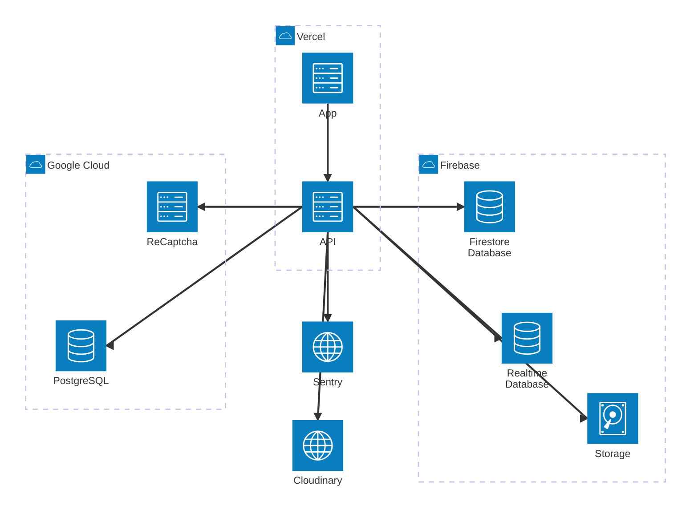

# test

```mermaid

architecture-beta
    group vercel(cloud)[Vercel]
    group firebase(cloud)[Firebase]
    group gcp(cloud)[Google Cloud]
    service app(server)[App] in vercel
    service api(server)[API] in vercel
    service file_storage(disk)[Storage] in firebase
    service rdbm(database)[Realtime Database] in firebase
    service firestore(database)[Firestore Database] in firebase
    service postgresql(database)[PostgreSQL] in gcp
    service recaptcha(server)[ReCaptcha] in gcp
    service cloudinary(internet)[Cloudinary]
    service sentry(internet)[Sentry]
    api:T <-- B:app
    api:R --> L:file_storage
    api:R --> L:rdbm
    api:R --> L:firestore
    api:L --> R:postgresql
    api:B --> T:cloudinary
    api:B --> T:sentry
    api:L --> R:recaptcha

```
